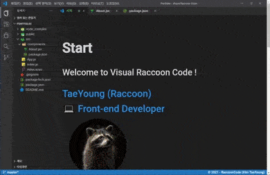

# 💼 포트폴리오 만들기

FE 개발자를 준비하면서, 포트폴리오 페이지를 만들었습니다.

포트폴리오 페이지는 개발자라면 누구나 사용하는 vscode 에디터에 영감을 받아 vscode 에디터 디자인을 참고한 스타일로 포트폴리오 페이지를 구현하였습니다.

저는 많은 프로젝트를 진행하지 않고 하나의 프로젝트를 가지고 계속해서 기능을 추가하는 형식의 프로젝트를 진행하다보니, 제시할 프로젝트가 적습니다. 그래서 인상에 남는 포트폴리오라도 보여드리고 싶어 흥미로운 디자인의 포트폴리오를 만들었습니다.

일단은, 포트폴리오를 목적으로 만들었지만 더 확장시켜 나중에는 해당 스타일을 블로그로 만들려고 합니다.

 

## 기간

- 9월 1일 ~ 9월 6일 (총 6일)

 

## Visual Raccoon Code

visual studio code의 디자인을 아이디어로 필명인 RaccoonCode(라쿤코드)를 접목하여 Visual Raccoon Code (vrcode)를 제목으로 정하였습니다.

 

## 화면

 
 
 

## 기능

- project 사이드바의 검색 기능
- study 페이지의 각 항목 설명 더 보기 기능
- Contact 페이지의 전화번호, 이메일 클릭시 클립보드 복사 기능
- 반응형 스타일

 
 
 

## 사용한 기술

포트폴리오 페이지의 경우 정적인 페이지이기 때문에, server 구성 없이 단순히 client만 만들어서 github page로 배포하였습니다.

- React, CRA
- Ant Design
- Scss (sass는 node-sass 보다 차후에 dart-sass 지원만 할 예정이기에 기본 sass로 채택)
- github page

 
 
